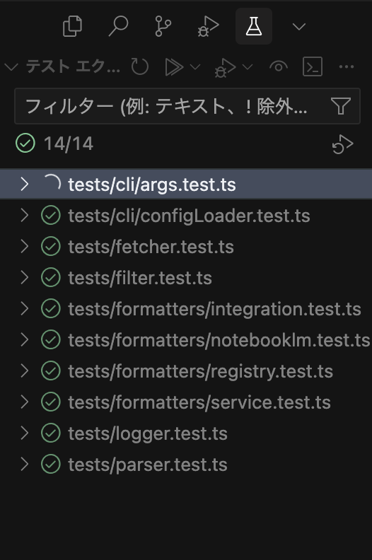
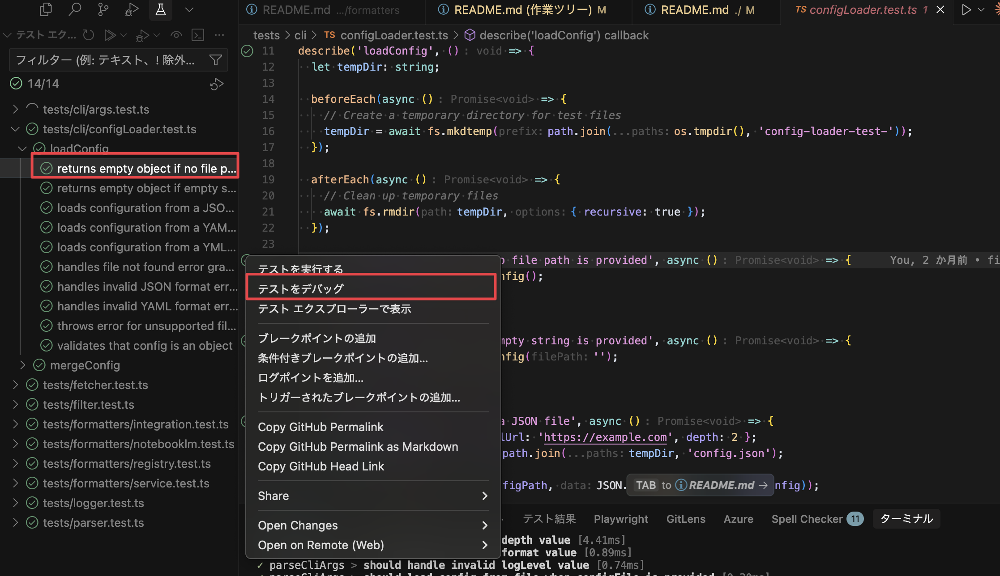
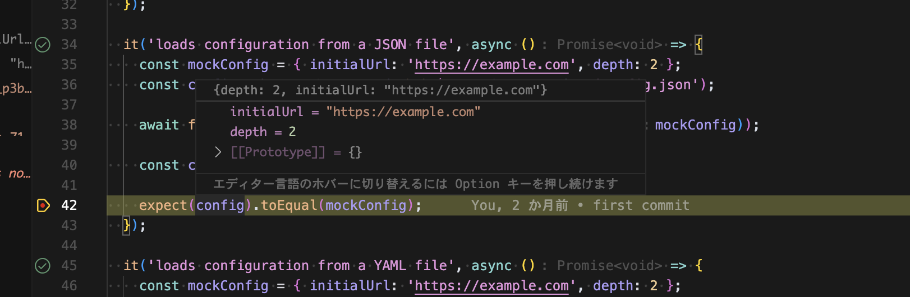

# WebLinkCollector

English | [日本語](./README-ja.md)

A library and CLI tool to recursively collect links from a given initial URL and output them as structured data.

## Features

- Recursively crawl web pages up to a configurable depth (max 5)
- Extract links from HTML content using CSS selectors
- Filter URLs by domain, path prefix, regex patterns, and keywords
- Exclude URLs embedded in query parameters and hash fragments
- Output results as JSON or plain text
- Configurable logging levels and request delays
- Support for configuration via JSON/YAML files

## Installation

### Global Installation

```bash
npm install -g web-link-collector
```

### Local Installation

```bash
npm install web-link-collector
```

### Using from CDN

```html
<script type="module">
  import { collectLinks } from 'https://cdn.jsdelivr.net/npm/web-link-collector@1.0.0/dist/index.js';

  // Use the library as needed
  async function main() {
    const results = await collectLinks('https://example.com', { depth: 1 });
    console.log(results);
  }
</script>
```

### Development Setup

Clone the repository and install dependencies:

```bash
git clone https://github.com/yourusername/web-link-collector.git
cd web-link-collector
npm install
```

Run linting:

```bash
npm run lint
```

Run tests:

```bash
npm run test
```

Build the project:

```bash
npm run build
```

### Publishing to npm

To publish a new version to npm, follow these steps:

1. Update the version in `package.json`:

```bash
npm version patch  # For bug fixes
npm version minor  # For new features
npm version major  # For breaking changes
```

2. Publish to npm:

```bash
npm publish
```

The package will automatically run linting and tests via the `prepublishOnly` script before publishing.

#### Available Scripts

| Script              | Description                                   |
| ------------------- | --------------------------------------------- |
| `npm run build`     | Compile TypeScript to JavaScript              |
| `npm run test`      | Run all tests                                 |
| `npm run test:core` | Run core functionality tests (same as `test`) |
| `npm run lint`      | Check for linting issues                      |
| `npm run lint:fix`  | Fix linting issues automatically              |
| `npm run format`    | Format code with Prettier                     |
| `npm run check`     | Run linting and tests                         |
| `npm run start`     | Run the CLI tool                              |

#### Git Hooks

This project uses Husky to enforce code quality with the following git hooks:

- **pre-commit**: runs linting, formatting, and tests on staged files
- **pre-push**: ensures all linting and tests pass before pushing changes

## Development with VSCode

### Debugging Bun Tests

This project uses Bun for testing. To debug tests in VSCode properly, you **must** use the Test Explorer instead of the inline debug buttons in code files.

#### Setup Requirements

1. Install the Bun VSCode extension: `oven.bun-vscode`
2. Reload VSCode after installation

#### Debug Process

**⚠️ Important:** Do NOT use the debug buttons that appear above test functions in the code editor - these will not work correctly with Bun tests.

Instead, follow these steps:

1. **Open Test Explorer**



2. **Find Your Test**

   Navigate to the test you want to debug in the Test Explorer panel.

3. **Use Debug Button in Test Explorer**

   Click the debug button (🐛) next to the specific test in the Test Explorer panel.



4. **Debugging Session**

The test will run in debug mode with proper Bun support and breakpoints will work correctly.



#### Why This Method is Required

- VSCode's inline debug buttons use Node.js debugging by default
- Bun tests require the Bun runtime, not Node.js
- The Test Explorer integrates properly with the Bun extension
- This ensures correct TypeScript and ES module handling

#### Alternative: Terminal Debugging

You can also debug from the terminal:

```bash
# Debug all tests
bun test --inspect

# Debug specific test file
bun test --inspect tests/formatters/notebooklm.test.ts
```

## CLI Usage

Basic usage with the CLI tool:

```bash
# Development mode (recommended for local usage)
bun run dev --initialUrl https://example.com --depth 2

# Using built CLI
bun run start --initialUrl https://example.com --depth 2

# Direct execution
bun dist/bin/web-link-collector.js --initialUrl https://example.com --depth 2

# Global installation (if installed globally)
web-link-collector --initialUrl https://example.com --depth 2

# Using npx (if published to npm)
npx web-link-collector --initialUrl https://example.com --depth 2
```

### CLI Options

| Option          | Description                                                                      | Default    |
| --------------- | -------------------------------------------------------------------------------- | ---------- |
| `--initialUrl`  | The starting URL for link collection                                             | _Required_ |
| `--depth`       | The maximum recursion depth (0-5)                                                | 1          |
| `--filters`     | JSON string of filter conditions                                                 | None       |
| `--filtersFile` | Path to a JSON or YAML file containing filter conditions                         | None       |
| `--selector`    | CSS selector to limit link extraction scope (only for the initial page)          | None       |
| `--element`     | HTML tag name to use as starting point for link extraction (e.g., main, article) | None       |
| `--delayMs`     | Delay in milliseconds between requests (recommended: 50)                         | 1000       |
| `--logLevel`    | Logging level (debug, info, warn, error, none)                                   | info       |
| `--output`      | Output file path (if not specified, outputs to stdout)                           | None       |
| `--format`      | Output format (json, txt)                                                        | json       |
| `--configFile`  | Path to a JSON or YAML configuration file                                        | None       |
| `--skipQuery`   | Skip URLs embedded in query parameters                                           | true       |
| `--skipHash`    | Skip URLs embedded in hash fragments                                             | true       |
| `--help`, `-h`  | Show help message                                                                | -          |

### Examples

Collect links from a website with a recursion depth of 2:

```bash
# Development mode (recommended)
bun run dev --initialUrl https://example.com --depth 2

# Using built CLI
bun run start --initialUrl https://example.com --depth 2
```

Only collect links from the specified domain:

```bash
bun run dev --initialUrl https://example.com --filters '{"domain": "example.com"}'
```

Limit link extraction to a specific section of the initial page:

```bash
bun run dev --initialUrl https://example.com --selector ".main-content a"
```

Limit link extraction to a specific HTML element on the initial page:

```bash
bun run dev --initialUrl https://example.com --element main
```

Output results to a text file:

```bash
bun run dev --initialUrl https://example.com --output results.txt --format txt
```

Disable skipping URLs in query parameters:

```bash
bun run dev --initialUrl https://example.com --skipQuery false
```

Use a configuration file:

```bash
# Development mode (recommended)
bun run dev --configFile config.yaml

# Using built CLI
bun run start --configFile config.yaml
```

## Library Usage

You can also use WebLinkCollector as a library in your Node.js applications:

```javascript
import { collectLinks } from 'web-link-collector';

// Simple usage
const results = await collectLinks('https://example.com', {
  depth: 2,
});

console.log(results);

// With more options
const results = await collectLinks('https://example.com', {
  depth: 2,
  filters: [{ domain: 'example.com' }, { domain: 'api.example.com' }],
  selector: '.main-content a',
  delayMs: 2000,
  logLevel: 'info',
  skipQueryUrls: true, // Skip URLs embedded in query parameters
  skipHashUrls: true, // Skip URLs embedded in hash fragments
});

// Access results
console.log(`Collected ${results.allCollectedUrls.length} URLs`);
console.log(`Found ${results.linkRelationships.length} link relationships`);
console.log(`Encountered ${results.errors.length} errors`);
console.log(`Duration: ${results.stats.durationMs}ms`);
```

### TypeScript Usage Example

You can also use it with TypeScript. Create a file, for example, `examples/library_usage_example.ts`:

```typescript
import { collectLinks } from 'web-link-collector'; // Adjust path if necessary, e.g., '../src' for local development

async function main() {
  try {
    const results = await collectLinks('https://example.com', {
      depth: 1,
    });
    console.log('Collected links:', results);
  } catch (error) {
    console.error('Error occurred:', error);
  }
}

main();
```

To run this TypeScript example, you'll need `ts-node`:

```bash
# Install ts-node if you haven't already
npm install -D ts-node
# or
# pnpm add -D ts-node
# or
# yarn add -D ts-node

# Execute the script
npx ts-node examples/library_usage_example.ts
```

## Configuration Files

You can use JSON or YAML configuration files to specify options. Here's an example:

```yaml
initialUrl: https://example.com
depth: 2
delayMs: 50 # Recommended: 50ms for faster crawling
logLevel: info
format: json

# CSS selector to limit link extraction on the initial page
selector: '.main-content a'

# HTML tag name to use as starting point for link extraction
element: 'main'

# Skip URLs in query parameters and hash fragments
skipQueryUrls: true
skipHashUrls: true

# Filters define which URLs will be collected
filters:
  # First filter condition (OR logic between filter objects)
  - domain: example.com
    pathPrefix: /blog

  # Second filter condition
  - domain: api.example.com
```

### Important Notes About Configuration Files

1. **YAML Special Characters**: When using special characters in YAML (like `#`, `:`, etc.), you must wrap the value in quotes. For example, use `selector: "#main"` instead of `selector: #main`.

2. **CLI vs Configuration Priority**: When both CLI options and a configuration file are provided, the CLI options take precedence. Only CLI options that are explicitly specified will override the configuration file values.

3. **Selector and Element Behavior**: The CSS selector and element options are only applied to the initial page (depth 0) to extract links. Subsequent pages will have all links extracted regardless of the selector or element. If both options are specified, selector takes precedence.

4. **URL Exclusion**: URLs embedded in query parameters or hash fragments, such as social media share links (e.g., `https://twitter.com/share?url=https://example.com`), are skipped by default.

See the `examples` directory for more configuration examples.

## Filter Options

Filters allow you to control which URLs are collected:

- `domain`: String or array of strings to match against URL domains
- `pathPrefix`: String or array of strings to match against URL paths
- `regex`: String or array of regex patterns to match against full URLs
- `keywords`: String or array of strings to match anywhere in the URL

Multiple filter objects are combined with OR logic, while conditions within a single filter object use AND logic.

## Result Format

The JSON output structure includes:

```typescript
{
  initialUrl: string;
  depth: number;
  allCollectedUrls: string[];
  linkRelationships: {
    source: string;
    found: string;
  }[];
  errors: {
    url: string;
    errorType: string;
    message: string;
  }[];
  stats: {
    startTime: string;
    endTime: string;
    durationMs: number;
    totalUrlsScanned: number;
    totalUrlsCollected: number;
    maxDepthReached: number;
  };
}
```

## License

MIT
